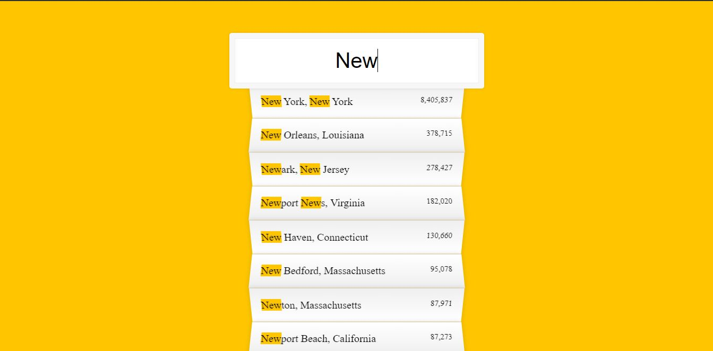

# TypeAhead

This is from day 6 / 30 of Wes Bos' JavaScript30 course.  In this lesson we used an Ajax call and fetch to print data from a JSON file of cities and populations in the united states to HTML.  If you're interested you can find the course lessons <a href src="https://www.youtube.com/watch?v=y4gZMJKAeWs&list=PLu8EoSxDXHP6CGK4YVJhL_VWetA865GOH&index=6">here.</a>

